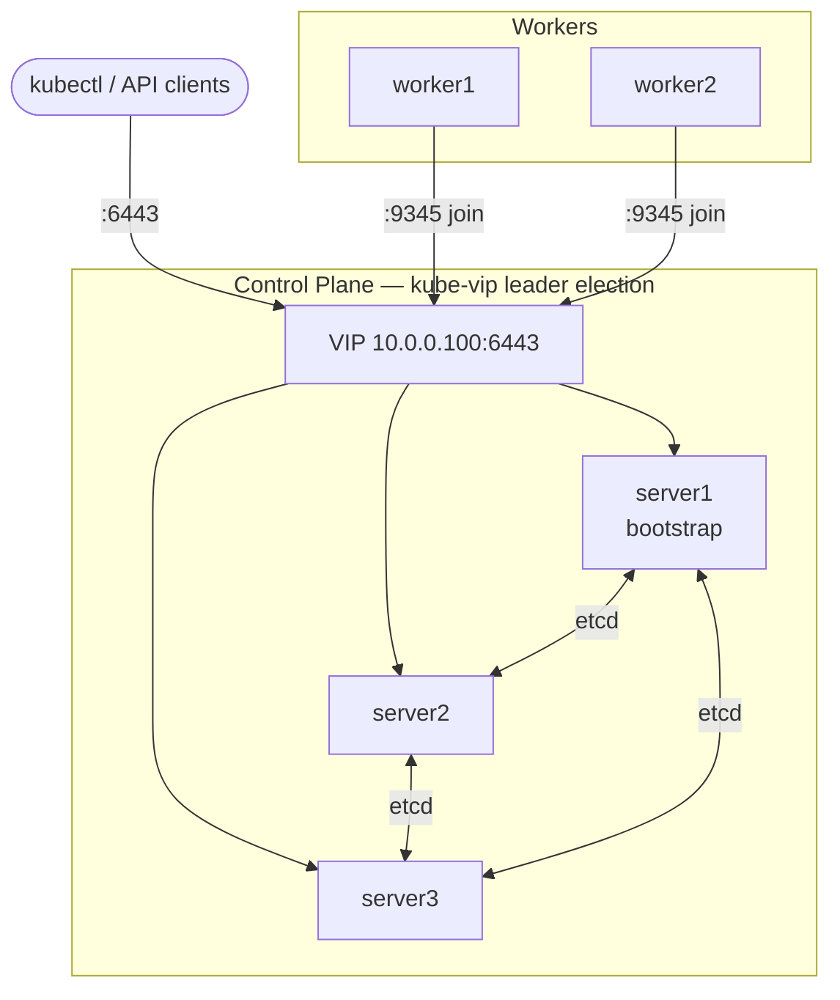
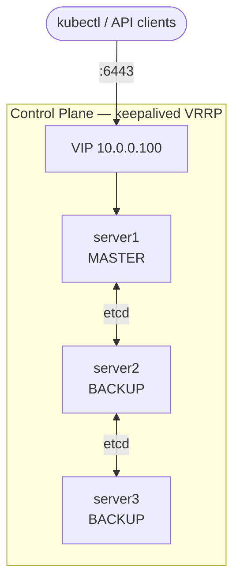

# Ansible Role - RKE2

[](https://github.com/devopsgroupeu/ansible-role-rke2/actions/workflows/lint.yml)
[](https://github.com/devopsgroupeu/ansible-role-rke2/actions/workflows/molecule.yml)
[](https://galaxy.ansible.com/devopsgroup/rke2)


[](https://www.linkedin.com/company/devopsgroup8/)


Ansible role for installing and configuring [RKE2](https://docs.rke2.io/) — Rancher's next-generation Kubernetes distribution. Supports single-node, server+agent, and 3-server HA deployments with kube-vip or keepalived VIP management, air-gapped installs, kube-vip LoadBalancer cloud provider, rolling upgrades, custom CA certificates, and automatic certificate rotation.

---

## Table of Contents

- [Requirements](#requirements)
- [Quick Start](#quick-start)
  - [Single Node](#single-node)
  - [Server + Agent Nodes](#server--agent-nodes)
  - [HA Cluster with kube-vip](#ha-cluster-with-kube-vip)
  - [HA Cluster with keepalived](#ha-cluster-with-keepalived)
- [Inventory Structure](#inventory-structure)
- [Variables](#variables)
- [VIP Architecture](#vip-architecture)
- [Cloud Floating IP Failover](#cloud-floating-ip-failover)
- [kube-vip LoadBalancer Cloud Provider](#kube-vip-loadbalancer-cloud-provider)
- [Air-Gapped Install](#air-gapped-install)
- [Rolling Upgrades](#rolling-upgrades)
- [Separate Agent Token](#separate-agent-token)
- [Kubeconfig](#kubeconfig)
- [Helm Addons](#helm-addons)
- [Testing](#testing)
- [Troubleshooting](#troubleshooting)
- [Contributing](#contributing)
- [License](#license)

---

## Requirements

- ansible-core >= 2.19
- Python >= 3.9
- Target nodes: Ubuntu 22.04 / 24.04, Debian 12, Rocky Linux 9, Oracle Linux 9
- `become: true` (root access required)
- For HA: odd number of server nodes (3 recommended), reachable by each other on ports 9345 (join) and 6443 (API)

---

## Quick Start

### Single Node

```yaml
# inventory/hosts.yaml
all:
  children:
    server_nodes:
      hosts:
        rke2-server:
          ansible_host: 10.0.0.10
```

```yaml
# playbook.yaml
- name: Install RKE2
  hosts: all
  become: true
  vars:
    rke2_version: v1.36.1+rke2r2
    rke2_tls_san:
      - "10.0.0.10"
  roles:
    - role: ansible-role-rke2
```

```bash
ansible-playbook -i inventory/hosts.yaml playbook.yaml
```

---

### Server + Agent Nodes

```yaml
# inventory/hosts.yaml
all:
  children:
    server_nodes:
      hosts:
        rke2-server:
          ansible_host: 10.0.0.10
    agent_nodes:
      hosts:
        rke2-worker1:
          ansible_host: 10.0.0.21
        rke2-worker2:
          ansible_host: 10.0.0.22
```

```yaml
# playbook.yaml
- name: Install RKE2
  hosts: all
  become: true
  vars:
    rke2_version: v1.36.1+rke2r2
  roles:
    - role: ansible-role-rke2
```

---

### HA Cluster with kube-vip

Three server nodes with a floating VIP managed by [kube-vip](https://kube-vip.io/) running as a DaemonSet on every control plane node. No external load balancer required.

```yaml
# inventory/hosts.yaml
all:
  children:
    server_nodes:
      hosts:
        rke2-server1:
          ansible_host: 10.0.0.11
        rke2-server2:
          ansible_host: 10.0.0.12
        rke2-server3:
          ansible_host: 10.0.0.13
    agent_nodes:
      hosts:
        rke2-worker1:
          ansible_host: 10.0.0.21
```

```yaml
# playbook.yaml
- name: Install RKE2 HA
  hosts: all
  become: true
  vars:
    rke2_version: v1.36.1+rke2r2
    rke2_vip_enabled: true
    rke2_vip_address: "10.0.0.100"
    rke2_vip_interface: "eth0"
    rke2_vip_manager: "kubevip"
    rke2_tls_san:
      - "rke2.example.com"
      # VIP is added to tls-san automatically
  roles:
    - role: ansible-role-rke2
```

---

### HA Cluster with keepalived

keepalived manages the VIP via VRRP directly on the server nodes. Health checks verify the API server and RKE2 registration port before failing over. **Unicast VRRP** is used — works on cloud SDN networks (Hetzner, AWS VPC, GCP) where multicast `224.0.0.18` is filtered.

**Inventory requirement:** each server node must have a `private_ip` host variable set to its LAN/private IP. keepalived uses it to build the unicast peer list. If omitted, `ansible_host` is used as fallback.

```ini
# inventory/hosts.ini
[server_nodes]
rke2-server1  ansible_host=10.0.0.11  private_ip=10.0.0.11
rke2-server2  ansible_host=10.0.0.12  private_ip=10.0.0.12
rke2-server3  ansible_host=10.0.0.13  private_ip=10.0.0.13
```

```yaml
# group_vars/all.yml
rke2_vip_enabled: true
rke2_vip_address: "10.0.0.100"
rke2_vip_interface: "eth0"
rke2_vip_manager: "keepalived"
rke2_keepalived_router_id: 51
rke2_keepalived_auth_pass: "rke2vip"
```

keepalived deploys two health check scripts on each server node:
- `/etc/keepalived/check-apiserver.sh` — curls `/healthz` on port 6443
- `/etc/keepalived/check-rke2server.sh` — curls the RKE2 registration API on port 9345

If both checks fail on the MASTER, keepalived drops its VRRP priority and another node takes over the VIP.

---

## Inventory Structure

The role uses two inventory groups:

| Group | Purpose |
|-------|---------|
| `server_nodes` | RKE2 control plane nodes (etcd + API server). First host in group bootstraps the cluster. |
| `agent_nodes` | RKE2 worker nodes. Optional — omit for control-plane-only clusters. |

The **first host** in `server_nodes` is the bootstrap node. All other server nodes and agents join through it.

---

## Variables

All variables are defined in [`defaults/main.yml`](defaults/main.yml) with inline documentation. Full type and constraint information is in [`meta/argument_specs.yml`](meta/argument_specs.yml).

### Core

| Variable | Default | Description |
|----------|---------|-------------|
| `rke2_version` | `v1.36.1+rke2r2` | RKE2 version to install |
| `rke2_cluster_token` | `""` | Pre-shared cluster token. Auto-generated when empty. |
| `rke2_agent_token` | `""` | Separate token for agent nodes (less privileged than server token) |
| `rke2_allow_downgrade` | `false` | Allow installing a version older than currently installed |
| `rke2_airgapped` | `false` | Enable air-gapped installation mode |
| `rke2_airgapped_artifacts_dir` | `""` | Path on controller to pre-downloaded artifacts |

### VIP / HA

| Variable | Default | Description |
|----------|---------|-------------|
| `rke2_vip_enabled` | `false` | Enable VIP for HA control plane |
| `rke2_vip_address` | `""` | The VIP IP address |
| `rke2_vip_interface` | `eth0` | Network interface for VIP |
| `rke2_vip_manager` | `kubevip` | VIP manager: `kubevip` or `keepalived` |
| `rke2_kubevip_version` | `v1.2.0` | kube-vip image tag |
| `rke2_kubevip_svc_enable` | `false` | Enable kube-vip watching of LoadBalancer Services |
| `rke2_kubevip_service_election_enable` | `false` | Per-service leader election |
| `rke2_kubevip_metrics_port` | `0` | Prometheus metrics port (0 = disabled) |
| `rke2_kubevip_cloud_provider_enabled` | `false` | Deploy kube-vip cloud provider for LoadBalancer Services |
| `rke2_kubevip_cloud_provider_image` | `ghcr.io/kube-vip/kube-vip-cloud-provider:v0.0.12` | Cloud provider image |
| `rke2_kubevip_load_balancer_ip_range` | `""` | IP pool: CIDR (`192.168.0.200/29`) or range (`192.168.0.200-192.168.0.250`) |
| `rke2_keepalived_router_id` | `51` | VRRP virtual router ID (1-255, unique per subnet) |
| `rke2_keepalived_priority_master` | `101` | VRRP priority for first server (MASTER) |
| `rke2_keepalived_priority_backup` | `100` | VRRP priority for additional servers (BACKUP) |
| `rke2_keepalived_auth_pass` | `rke2vip` | VRRP authentication password (max 8 chars) |
| `rke2_keepalived_failover_enabled` | `false` | Enable cloud floating IP failover via `notify_master` hook |
| `rke2_keepalived_failover_script` | `/etc/keepalived/notify-master.sh` | Path on target nodes for the notify script |
| `rke2_keepalived_failover_script_content` | `""` | Shell script body executed when this node becomes MASTER |
| `rke2_keepalived_failover_env` | `{}` | Key/value pairs written to a protected env file (mode 0600) |
| `rke2_agent_server_address` | `""` | Override server address in agent config (useful on cloud SDN like Hetzner) |

### Networking

| Variable | Default | Description |
|----------|---------|-------------|
| `rke2_tls_san` | `[]` | Additional SANs for the API server TLS certificate |
| `rke2_cluster_cidr` | `""` | Pod network CIDR (RKE2 default: `10.42.0.0/16`) |
| `rke2_service_cidr` | `""` | Service network CIDR (RKE2 default: `10.43.0.0/16`) |
| `rke2_cluster_domain` | `""` | Cluster domain (default: `cluster.local`) |
| `rke2_cni` | `default` | CNI plugin: `canal`, `cilium`, `calico`, `flannel`, `default` |
| `rke2_disable_kube_proxy` | `false` | Disable kube-proxy (for Cilium kube-proxy replacement) |

### Proxy

| Variable | Default | Description |
|----------|---------|-------------|
| `rke2_http_proxy` | `""` | HTTP proxy for RKE2 and containerd |
| `rke2_https_proxy` | `""` | HTTPS proxy for RKE2 and containerd |
| `rke2_no_proxy` | `""` | Comma-separated no-proxy list |

### Cloud Provider

| Variable | Default | Description |
|----------|---------|-------------|
| `rke2_disable_cloud_controller` | `false` | Disable built-in cloud controller manager |
| `rke2_cloud_provider_name` | `""` | Cloud provider name (e.g. `external`, `aws`, `azure`) |

### Rolling Upgrades

| Variable | Default | Description |
|----------|---------|-------------|
| `rke2_drain_node_during_upgrade` | `false` | Cordon and drain nodes before restarting during upgrades |
| `rke2_drain_additional_args` | `--timeout=120s` | Extra arguments passed to `kubectl drain` |
| `rke2_wait_for_all_pods_to_be_ready` | `false` | Wait for all pods to be Running/Succeeded after uncordon |

### Kubeconfig

| Variable | Default | Description |
|----------|---------|-------------|
| `rke2_kubeconfig_download` | `false` | Fetch kubeconfig to Ansible controller after install |
| `rke2_kubeconfig_output_path` | `{{ playbook_dir }}/rke2.yaml` | Local path on controller to write kubeconfig |

### Certificates

| Variable | Default | Description |
|----------|---------|-------------|
| `rke2_cert_rotation_enabled` | `false` | Enable automatic certificate rotation via cron |
| `rke2_cert_rotation_expiry_threshold_days` | `20` | Rotate when cert expires within N days |
| `rke2_cert_rotation_schedule_type` | `weekly` | Schedule type: `daily`, `weekly`, `monthly` |

### etcd Snapshots

RKE2 takes local etcd snapshots by default; set `rke2_etcd_disable_snapshots: true` to turn them off.

| Variable | Default | Description |
|----------|---------|-------------|
| `rke2_etcd_disable_snapshots` | `false` | Disable RKE2's built-in etcd snapshots (snapshots are ON by default) |
| `rke2_etcd_snapshot_schedule` | `""` | Cron expression, e.g. `"0 */6 * * *"`. Ignored when snapshots are disabled |
| `rke2_etcd_snapshot_retention` | `5` | Number of local etcd snapshots to retain |
| `rke2_etcd_s3_enabled` | `false` | Enable off-cluster S3-compatible etcd snapshot upload |
| `rke2_etcd_s3_endpoint` | `""` | S3 endpoint host (e.g. `s3.amazonaws.com` or `minio.example.com:9000`) |
| `rke2_etcd_s3_bucket` | `""` | S3 bucket name for etcd snapshots |
| `rke2_etcd_s3_region` | `""` | S3 region (defaults to `us-east-1` in RKE2 when empty) |
| `rke2_etcd_s3_folder` | `""` | Optional path prefix inside the S3 bucket |
| `rke2_etcd_s3_access_key` | `""` | S3 access key. Source from Vault; rendered with `no_log` |
| `rke2_etcd_s3_secret_key` | `""` | S3 secret key. Source from Vault; rendered with `no_log` |
| `rke2_etcd_s3_endpoint_ca` | `""` | Optional PEM CA bundle for a private S3 endpoint |
| `rke2_etcd_s3_skip_ssl_verify` | `false` | Skip TLS verification of the S3 endpoint (lab/self-signed only) |

### Hardening

| Variable | Default | Description |
|----------|---------|-------------|
| `rke2_cis_profile` | `""` | CIS hardening profile: `cis` (RKE2 ≥ 1.25) or `cis-1.23` |
| `rke2_selinux` | `false` | Enable SELinux mode for RKE2 and containerd |

---

## Cloud Floating IP Failover

When using `rke2_vip_manager: keepalived`, the role can automatically reassign a cloud provider floating IP to whichever node becomes the keepalived MASTER. This combines the internal VRRP VIP (for private traffic) with an external floating IP (for public traffic) so both always point to the same active node.

The mechanism is provider-agnostic — you supply the script and credentials, the role deploys and wires them into keepalived's `notify_master` directive.

```yaml
rke2_keepalived_failover_enabled: true

# Path where the script is deployed on each server node
rke2_keepalived_failover_script: /etc/keepalived/notify-master.sh

# Environment variables written to /etc/keepalived/failover.env (mode 0600)
rke2_keepalived_failover_env:
  API_TOKEN: "{{ lookup('env', 'CLOUD_API_TOKEN') }}"
  FLOATING_IP_ID: "{{ lookup('env', 'FLOATING_IP_ID') }}"

# Script body — executed when this node becomes MASTER
# Sources failover.env automatically (same directory as the script)
rke2_keepalived_failover_script_content: |
  #!/bin/bash
  set -e
  source "$(dirname "$0")/failover.env"
  SERVER_ID=$(curl -sf http://169.254.169.254/hetzner/v1/metadata/instance-id)
  curl -sf -X POST \
    "https://api.hetzner.cloud/v1/floating_ips/${FLOATING_IP_ID}/actions/assign" \
    -H "Authorization: Bearer ${API_TOKEN}" \
    -H "Content-Type: application/json" \
    -d "{\"server\": ${SERVER_ID}}" -o /dev/null
  echo "$(date -u): floating IP ${FLOATING_IP_ID} assigned to server ${SERVER_ID}" \
    >> /var/log/keepalived-failover.log
```

**Failover sequence:**
1. A server node fails its health checks (API server or port 9345 unreachable)
2. keepalived VRRP elects a new MASTER — internal VIP moves automatically
3. `notify_master` fires the script on the new MASTER
4. Script calls the cloud API to reassign the floating IP
5. Both the private VIP and the public floating IP now point to the same node

**The env file** (`failover.env`) is deployed with `mode: 0600`, owned by root — API tokens are never written to the script body or visible in process listings.

---

## VIP Architecture

### kube-vip (recommended for on-prem / bare-metal)

kube-vip runs as a **DaemonSet** on every control plane node and uses ARP + leader election to own the VIP. Deployed via RKE2's auto-manifest directory (`server/manifests/`) which grants it a proper ServiceAccount token.



### keepalived (VRRP)

keepalived manages the VIP directly via VRRP. The role installs keepalived, deploys the configuration, and places health check scripts (`/etc/keepalived/check-apiserver.sh`, `check-rke2server.sh`) that probe the API server and RKE2 registration port before triggering failover.



> **Cloud SDN note (Hetzner, etc.):** Gratuitous ARP-based VIPs are not routable across Hetzner private networks. Set `rke2_agent_server_address` to a directly reachable server IP or load balancer address to bypass the VIP for agent registration.

---

## kube-vip LoadBalancer Cloud Provider

The kube-vip cloud provider assigns IPs from a configured pool to `type: LoadBalancer` Services, enabling on-prem load balancer functionality without a cloud provider.

```yaml
vars:
  rke2_vip_enabled: true
  rke2_vip_address: "10.0.0.100"
  rke2_vip_manager: "kubevip"

  # Enable cloud provider
  rke2_kubevip_cloud_provider_enabled: true
  rke2_kubevip_load_balancer_ip_range: "10.0.0.200-10.0.0.250"

  # Required: disable the built-in cloud controller and set provider to external
  rke2_disable_cloud_controller: true
  rke2_cloud_provider_name: "external"
```

The role automatically enables `svc_enable=true` on the kube-vip DaemonSet when the cloud provider is enabled. Accepts CIDR notation (`192.168.0.200/29`) or a range (`192.168.0.200-192.168.0.250`).

---

## Air-Gapped Install

Set `rke2_airgapped: true` and point `rke2_airgapped_artifacts_dir` to a directory on the **Ansible controller** containing the pre-downloaded artifacts:

```
rke2-artifacts/
  rke2-install.sh           # from https://get.rke2.io
  rke2.linux-amd64.tar.gz   # from GitHub releases
  sha256sum-amd64.txt        # from GitHub releases
  rke2-images.linux-amd64.tar.zst  # optional — for fully offline image loading
```

```yaml
vars:
  rke2_airgapped: true
  rke2_airgapped_artifacts_dir: "{{ playbook_dir }}/rke2-artifacts"
```

The role copies all artifacts to the target nodes and runs the install script locally — no outbound internet required from the nodes.

---

## Rolling Upgrades

To upgrade RKE2 without downtime, run the playbook with `serial: 1` and set `rke2_drain_node_during_upgrade: true`. The role will cordon, drain, restart, wait for Ready, then uncordon each node before moving to the next.

```yaml
- name: Rolling upgrade RKE2
  hosts: server_nodes
  become: true
  serial: 1
  vars:
    rke2_version: v1.29.4+rke2r1
    rke2_drain_node_during_upgrade: true
    rke2_drain_additional_args: "--timeout=180s --delete-emptydir-data"
    rke2_wait_for_all_pods_to_be_ready: true
  tasks:
    - ansible.builtin.import_role:
        name: ansible-role-rke2
        tasks_from: rolling_restart
```

> **Note:** `serial: 1` is required at the play level. Without it all nodes restart simultaneously.

For a rolling restart of **agent (worker)** nodes, run the same `rolling_restart`
entry point against `hosts: agent_nodes` with `serial: 1`. The task auto-detects
the node type and restarts `rke2-agent`; cordon/drain still run when
`rke2_drain_node_during_upgrade: true`, delegated to a healthy server node.

```yaml
- name: Rolling restart RKE2 agents
  hosts: agent_nodes
  become: true
  serial: 1
  vars:
    rke2_drain_node_during_upgrade: true
  tasks:
    - ansible.builtin.import_role:
        name: ansible-role-rke2
        tasks_from: rolling_restart
```

---

## Separate Agent Token

RKE2 supports a dedicated agent token that gives worker nodes less cluster access than server nodes. Set different token values per group:

```yaml
# group_vars/server_nodes.yml
rke2_cluster_token: "my-strong-server-token"
rke2_agent_token: "my-agent-token"

# group_vars/agent_nodes.yml
rke2_cluster_token: "my-agent-token"
```

When `rke2_agent_token` is set on servers, agent nodes must use that token (passed as `rke2_cluster_token` in their group vars). The role writes `agent-token` into the server config and uses `rke2_agent_token` (when set) as the `token` in the agent config automatically.

---

## Kubeconfig

After install, kubeconfig is available on the first server at `/etc/rancher/rke2/rke2.yaml` and copied to `~/.kube/config` for the Ansible user.

To also download it to the machine running Ansible:

```yaml
vars:
  rke2_kubeconfig_download: true
  rke2_kubeconfig_output_path: "~/.kube/rke2.yaml"
```

The downloaded kubeconfig points to `127.0.0.1:6443`. Update the server address before using remotely:

```bash
kubectl config set-cluster default \
  --server=https://10.0.0.100:6443 \
  --kubeconfig ~/.kube/rke2.yaml
```

---

## Ingress controller

From RKE2 v1.36 the default ingress is **Traefik** (`rke2-traefik`);
`rke2-ingress-nginx` is deprecated (upstream EOL March 2026, removed in v1.37).
Select the controller with `rke2_ingress_controller`:

| Value | Effect |
|-------|--------|
| `traefik` (default) | Disables rke2-ingress-nginx; applies `rke2_traefik_config` |
| `ingress-nginx` | Disables rke2-traefik; applies `rke2_ingress_nginx_config` |
| `none` | Disables both built-in controllers (bring your own) |

Migration: set `rke2_ingress_controller: ingress-nginx` to stay on nginx for
now, or `traefik` to adopt the new default and move custom values into
`rke2_traefik_config`.

---

## Helm Addons

RKE2 has a built-in [HelmChart CRD](https://docs.rke2.io/helm) that applies manifests placed in `/var/lib/rancher/rke2/server/manifests/` automatically. This role uses that mechanism to deploy optional addons on the first server node.

```yaml
rke2_addons:
  - name: argocd
    enabled: true
    repo: "https://argoproj.github.io/argo-helm"
    chart: argo-cd
    version: "7.7.11"
    namespace: argocd
    values:
      server:
        service:
          type: ClusterIP

  - name: cert-manager
    enabled: true
    repo: "https://charts.jetstack.io"
    chart: cert-manager
    version: "v1.16.2"
    namespace: cert-manager
    values:
      crds:
        enabled: true
```

| Key | Required | Description |
|-----|----------|-------------|
| `name` | yes | Unique name — used for the manifest filename |
| `enabled` | yes | Set `false` to skip without removing from the list |
| `repo` | yes | Helm chart repository URL |
| `version` | yes | Chart version to pin |
| `namespace` | yes | Kubernetes namespace to deploy into |
| `chart` | no | Chart name inside the repo (defaults to `name`) |
| `values` | no | Dict of Helm values merged into the HelmChart spec |

---

## Testing

The role includes two [Molecule](https://molecule.readthedocs.io/) scenarios using Docker containers:

| Scenario | Nodes | Tests |
|----------|-------|-------|
| `default` | 1 server | Binary, service, config, tls-san, cluster-domain, kubeconfig |
| `ha` | 3 servers + 1 agent | HA config, VIP tls-san, kube-vip DaemonSet, RBAC, cloud provider manifests, agent token |

```bash
# Install dependencies
pip install -r requirements.txt

# Run single-node scenario
molecule test -s default

# Run HA scenario
molecule test -s ha
```

---

## Troubleshooting

See [docs/TROUBLESHOOTING.md](docs/TROUBLESHOOTING.md) for common issues.

**Quick checks:**

```bash
# Service status
systemctl status rke2-server
journalctl -u rke2-server -f

# Node status (on server node)
export KUBECONFIG=/etc/rancher/rke2/rke2.yaml
/var/lib/rancher/rke2/bin/kubectl get nodes

# Check cluster token
cat /var/lib/rancher/rke2/server/node-token

# kube-vip DaemonSet status
/var/lib/rancher/rke2/bin/kubectl -n kube-system get ds kube-vip
```

---

## Contributing

We welcome contributions! Please see [CONTRIBUTING.md](CONTRIBUTING.md) to get started.

## Code of Conduct

Read our [Code of Conduct](CODE_OF_CONDUCT.md).

## Changelog

See [CHANGELOG.md](CHANGELOG.md) for release history.

## License

```
Copyright 2025 DevOpsGroup

Licensed under the Apache License, Version 2.0 (the "License");
you may not use this file except in compliance with the License.
You may obtain a copy of the License at

    http://www.apache.org/licenses/LICENSE-2.0

Unless required by applicable law or agreed to in writing, software
distributed under the License is distributed on an "AS IS" BASIS,
WITHOUT WARRANTIES OR CONDITIONS OF ANY KIND, either express or implied.
See the License for the specific language governing permissions and
limitations under the License.
```

---

> For more information or support, please refer to the [official RKE2 documentation](https://docs.rke2.io/) or contact us at info@devopsgroup.sk
