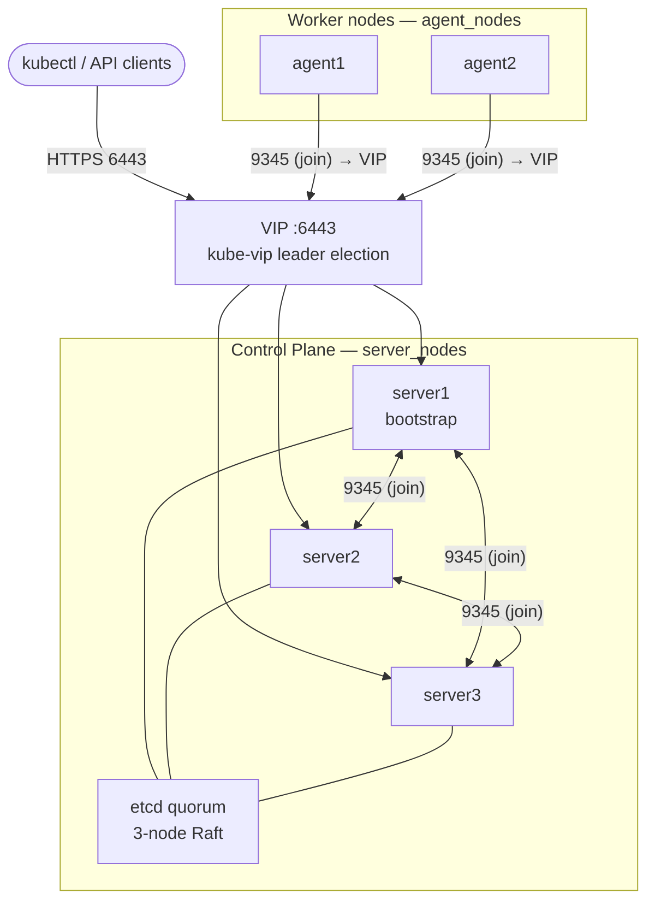
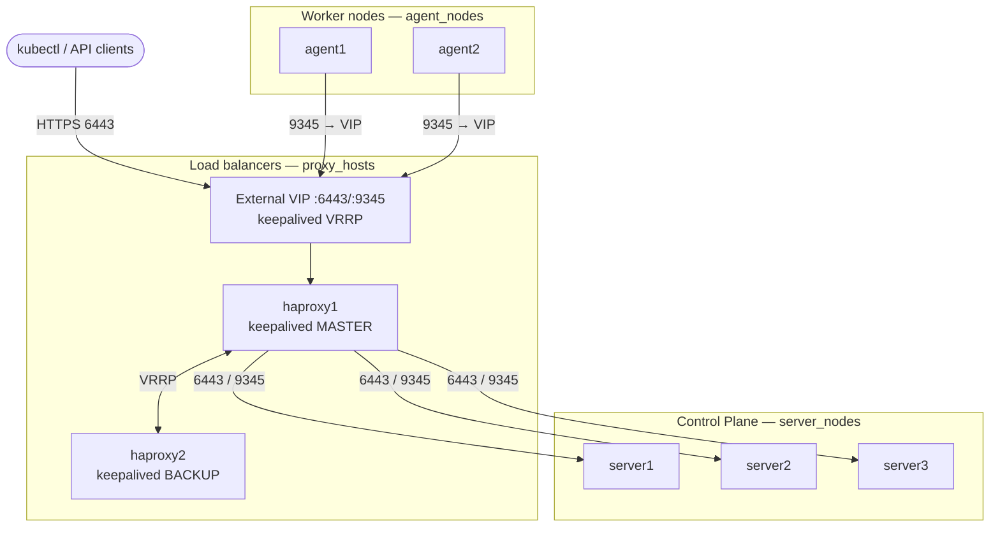
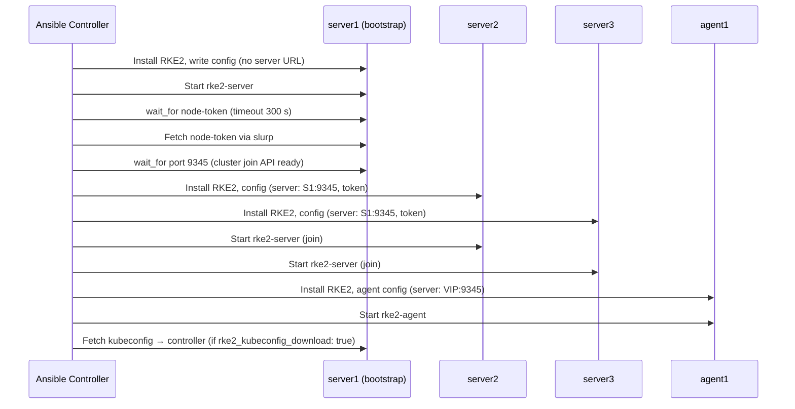

# Architecture

This document describes how the role deploys RKE2 in HA mode and how it integrates
with external components (HAProxy/keepalived, HashiCorp Vault).

See also: [INTEGRATION.md](INTEGRATION.md)

---

## HA Control-Plane Topology

Three server nodes form an etcd quorum. kube-vip runs as a DaemonSet on every
control-plane node and uses ARP leader election to own the VIP. Agent nodes join
through the VIP address.



---

## External HAProxy VIP Pattern

When `rke2_vip_manager: kubevip` is not suitable (e.g. ARP/GARP is restricted on
the network), an external HAProxy+keepalived VIP can front the cluster. HAProxy runs
on `proxy_hosts` nodes and load-balances ports 6443 and 9345 across `server_nodes`.



In this pattern set `rke2_vip_enabled: false` (HAProxy manages the VIP externally)
and `rke2_agent_server_address` to the HAProxy VIP address.

---

## HA Bootstrap Sequence



---

## Stack Composition Order

This role sits in the config tier, after network infrastructure is provisioned:

```
infrastructure (provision hosts: any cloud or bare-metal)
  → haproxy/keepalived (VIP layer)
    → hashicorp-vault (Raft cluster behind VIP)
      → rke2 servers (bootstrap + join)
        → rke2 agents (join via VIP)
          → in-cluster ESO / Vault Agent
```

Inventory group mapping:

| Group | Role that reads it |
|---|---|
| `server_nodes` | `devopsgroupeu.rke2` (control plane) |
| `agent_nodes` | `devopsgroupeu.rke2` (workers) |
| `proxy_hosts` | `devopsgroupeu.haproxy-keepalived` |
| `vault` | `devopsgroupeu.hashicorp-vault` |
