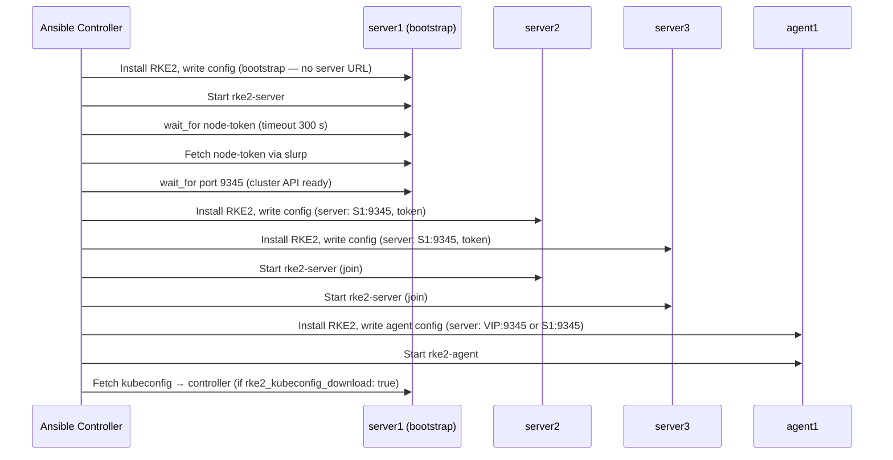

# Integration Guide

This guide covers how to integrate `ansible-role-rke2` with other roles, playbooks, and tools.

For topology diagrams and the bootstrap sequence, see [ARCHITECTURE.md](ARCHITECTURE.md).

---

## HA Bootstrap Sequence

When deploying a 3-server HA cluster, the role follows a strict sequence to ensure the cluster forms correctly before additional nodes join:



---

## Basic Playbook Structure

The role requires two inventory groups:

- `server_nodes` — control plane nodes (1 for single-node, 3 for HA)
- `agent_nodes` — worker nodes (optional)

```yaml
# site.yml
---
- name: Deploy RKE2
  hosts: server_nodes:agent_nodes
  become: true
  roles:
    - role: devopsgroupeu.rke2
```

---

## Inventory

```yaml
# inventory.yml (illustrative — ready-made examples: examples/inventory/{single-node,ha-kubevip,ha-keepalived}.yml)
all:
  children:
    server_nodes:
      hosts:
        server1:
          ansible_host: 10.0.0.1
        server2:
          ansible_host: 10.0.0.2
        server3:
          ansible_host: 10.0.0.3
    agent_nodes:
      hosts:
        worker1:
          ansible_host: 10.0.0.10
        worker2:
          ansible_host: 10.0.0.11
```

---

## group_vars

The recommended way to configure the role is via `group_vars`:

```
inventory/
  group_vars/
    all.yml          # variables shared across all hosts
    server_nodes.yml # server-specific overrides (rarely needed)
  hosts.yml          # your inventory file (you provide this)
```

**`inventory/group_vars/all.yml`:**

```yaml
rke2_version: "v1.36.1+rke2r2"

rke2_vip_enabled: true
rke2_vip_address: "10.0.0.100"
rke2_vip_interface: "ens3"
rke2_vip_manager: kubevip

rke2_tls_san:
  - "rke2.example.com"

rke2_kubeconfig_download: true
rke2_kubeconfig_output_path: "{{ playbook_dir }}/kubeconfig.yaml"
```

---

## Integration with ansible-role-haproxy-keepalived

When `rke2_vip_manager: kubevip` is not suitable (e.g. on environments where ARP/GARP is restricted),
you can use `keepalived` directly via this role. For HAProxy-based load balancing in front of the
control plane, combine with `ansible-role-haproxy-keepalived`:

```yaml
# site.yml
---
- name: Deploy HAProxy + Keepalived (load balancer)
  hosts: proxy_hosts
  become: true
  roles:
    - role: devopsgroupeu.haproxy-keepalived

- name: Deploy RKE2
  hosts: server_nodes:agent_nodes
  become: true
  roles:
    - role: devopsgroupeu.rke2
      vars:
        rke2_vip_enabled: true
        rke2_vip_address: "10.0.0.100"  # Must match HAProxy VIP
        rke2_vip_manager: kubevip        # kube-vip runs on control plane nodes
        rke2_tls_san:
          - "10.0.0.100"
```

In this pattern, HAProxy fronts the RKE2 API server (port 6443) and keepalived manages
the VIP on the load balancer nodes, while kube-vip manages the VIP on the control plane.

---

## Integration with Ansible Vault

Sensitive values (CA keys, registry passwords, keepalived auth) should be stored with Ansible Vault:

```bash
ansible-vault encrypt_string 'my-secret-password' --name 'rke2_keepalived_auth_pass'
ansible-vault encrypt_string "$(base64 < root-ca.key)" --name 'rke2_custom_root_ca_key'
```

Then reference in `group_vars/all.yml`:

```yaml
rke2_keepalived_auth_pass: !vault |
  $ANSIBLE_VAULT;1.1;AES256
  ...

rke2_custom_root_ca_key: !vault |
  $ANSIBLE_VAULT;1.1;AES256
  ...
```

Run the playbook with `--ask-vault-pass` or `--vault-password-file`.

---

## Using the Role as a Dependency

Add to your role's `meta/main.yml`:

```yaml
dependencies:
  - role: devopsgroupeu.rke2
    vars:
      rke2_version: "v1.36.1+rke2r2"
      rke2_vip_enabled: false
```

Or install from Galaxy and import in a playbook:

```bash
ansible-galaxy install devopsgroupeu.rke2
```

```yaml
- name: Deploy RKE2
  hosts: server_nodes:agent_nodes
  become: true
  roles:
    - devopsgroupeu.rke2
```

---

## Post-Install: Accessing the Cluster

After the role runs, the kubeconfig is available at:

- **On the first server node:** `/root/.kube/config` and `/etc/rancher/rke2/rke2.yaml`
- **On the controller** (when `rke2_kubeconfig_download: true`): at `rke2_kubeconfig_output_path`

Update the server address if you are using a VIP:

```bash
export KUBECONFIG=./rke2.yaml
kubectl config set-cluster default --server=https://10.0.0.100:6443
kubectl get nodes
```

---

## Running Only Specific Parts

Use tags to run subsets of the role:

```bash
# Run only proxy configuration
ansible-playbook site.yml --tags rke2_proxy

# Run only certificate (custom CA + rotation) setup
ansible-playbook site.yml --tags rke2_certs

# Skip VIP configuration
ansible-playbook site.yml --skip-tags rke2_vip
```

Available tags: `rke2_setup`, `rke2_proxy`, `rke2_certs`, `rke2_vip`, `rke2_addons`.
