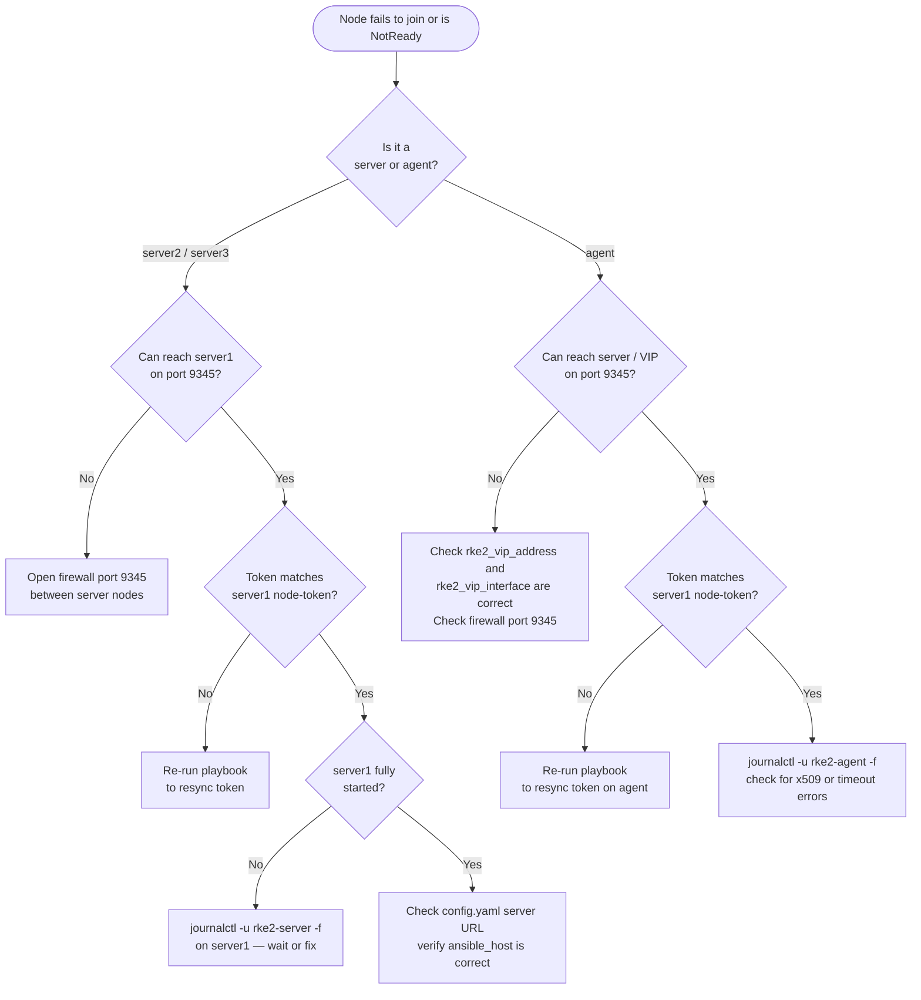

# Troubleshooting

Common issues and how to resolve them.

---

## Table of Contents

- [Quick diagnosis flowchart](#quick-diagnosis-flowchart)
- [Service fails to start](#service-fails-to-start)
- [Additional server nodes fail to join](#additional-server-nodes-fail-to-join)
- [Agent nodes fail to join](#agent-nodes-fail-to-join)
- [kube-vip VIP not reachable](#kube-vip-vip-not-reachable)
- [kubectl cannot connect to API server](#kubectl-cannot-connect-to-api-server)
- [Certificate errors](#certificate-errors)
- [Air-gapped install fails](#air-gapped-install-fails)
- [Nodes stuck in NotReady](#nodes-stuck-in-notready)
- [Useful commands reference](#useful-commands-reference)

---

## Quick diagnosis flowchart



---

## Service fails to start

**Symptom:** `systemctl status rke2-server` shows `failed` or `activating` indefinitely.

**Steps:**

```bash
# View live logs
journalctl -u rke2-server -f

# View last 100 lines
journalctl -u rke2-server -n 100 --no-pager
```

**Common causes:**

| Error in logs | Cause | Fix |
|---------------|-------|-----|
| `address already in use :6443` | Another process is using port 6443 | `ss -tlnp \| grep 6443` — stop the conflicting process |
| `failed to find memory cgroup` | cgroups v2 not enabled | Add `systemd.unified_cgroup_hierarchy=1` to kernel cmdline or use a supported OS image |
| `etcd cluster is unavailable` | etcd failed to start | Check disk space: `df -h /var/lib/rancher` — etcd requires fast storage |
| `x509: certificate signed by unknown authority` | Custom CA not trusted | Re-run with `rke2_custom_root_ca_cert` set correctly |

---

## Additional server nodes fail to join

**Symptom:** `rke2-server2` or `rke2-server3` fails with connection refused or token mismatch.

**Steps:**

```bash
# On the FIRST server node — verify the token
cat /var/lib/rancher/rke2/server/node-token

# On the FAILING node — check the config
cat /etc/rancher/rke2/config.yaml

# Verify the first server is reachable on port 9345 (cluster join port)
curl -k https://<first-server-ip>:9345/ping
```

**Common causes:**

- `server` URL in config points to wrong IP — verify `ansible_host` is set correctly in inventory
- Token mismatch — the token in `config.yaml` on additional nodes must match `node-token` on first server
- Firewall blocking port 9345 — ensure this port is open between server nodes

---

## Agent nodes fail to join

**Symptom:** Agent service starts but node does not appear in `kubectl get nodes`.

```bash
# On agent node
journalctl -u rke2-agent -f
cat /etc/rancher/rke2/config.yaml
```

**Common causes:**

- Port 9345 blocked between agent and server nodes
- Wrong VIP address in `server` URL — if using VIP, ensure it is reachable from agents
- Token mismatch — token must match the first server's `node-token`

---

## kube-vip VIP not reachable

**Symptom:** VIP address (`rke2_vip_address`) does not respond to ping or API requests.

**Steps:**

```bash
# Check kube-vip pod is running (run on a server node)
export KUBECONFIG=/etc/rancher/rke2/rke2.yaml
/var/lib/rancher/rke2/bin/kubectl get pods -n kube-system -l app.kubernetes.io/name=kube-vip

# Check kube-vip logs
/var/lib/rancher/rke2/bin/kubectl logs -n kube-system -l app.kubernetes.io/name=kube-vip

# Verify kube-vip manifest exists
ls -la /var/lib/rancher/rke2/server/manifests/kube-vip.yaml

# Check which node owns the VIP
ip addr show | grep <vip-address>
```

**Common causes:**

- Wrong `rke2_vip_interface` — must match the interface name on server nodes (check with `ip link`)
- VIP address already in use on the network — choose a free IP in the same subnet
- kube-vip manifest not deployed — only deployed on the **first** server node; verify `inventory_hostname == groups['server_nodes'][0]`

---

## kubectl cannot connect to API server

**Symptom:** `kubectl get nodes` returns `connection refused` or `i/o timeout`.

```bash
# Verify API server is listening
ss -tlnp | grep 6443

# Test locally on server node
curl -k https://127.0.0.1:6443/version

# Test via VIP (if HA)
curl -k https://<vip-address>:6443/version
```

**If using downloaded kubeconfig**, update the server address:

```bash
kubectl config set-cluster default \
  --server=https://<vip-or-server-ip>:6443 \
  --kubeconfig ~/.kube/rke2.yaml
```

---

## Certificate errors

**Symptom:** `x509: certificate is valid for ..., not <your-address>` when connecting.

**Cause:** The IP or hostname you are connecting through is not in the TLS SAN list.

**Fix:** Add the address to `rke2_tls_san` and re-run the playbook:

```yaml
rke2_tls_san:
  - "10.0.0.100"       # VIP
  - "rke2.example.com" # DNS name
```

> The VIP is added automatically when `rke2_vip_enabled: true` — no need to list it manually.

**Symptom:** Certificates are expiring.

```bash
# Check cert expiry on server node
for cert in /var/lib/rancher/rke2/server/tls/*.crt; do
  echo "$cert: $(openssl x509 -in $cert -noout -enddate 2>/dev/null)"
done
```

Enable automatic rotation: set `rke2_cert_rotation_enabled: true` and re-run.

---

## Air-gapped install fails

**Symptom:** Install script not found or download fails on target nodes.

**Check:**

```bash
# Verify script was copied
ls -la /tmp/rke2-install.sh
```

**Common causes:**

- Controller has no internet access and `rke2_airgapped: true` — pre-download the script:
  ```bash
  mkdir -p rke2-airgap-files
  curl -sfL https://get.rke2.io -o rke2-airgap-files/rke2-install.sh
  chmod +x rke2-airgap-files/rke2-install.sh
  ```
- The install script requires RKE2 artifacts — configure a private registry via `rke2_private_registries_config`

---

## Nodes stuck in NotReady

**Symptom:** `kubectl get nodes` shows nodes in `NotReady` state.

```bash
# Check node conditions
export KUBECONFIG=/etc/rancher/rke2/rke2.yaml
/var/lib/rancher/rke2/bin/kubectl describe node <node-name>

# Check CNI pods
/var/lib/rancher/rke2/bin/kubectl get pods -n kube-system
```

**Common causes:**

- CNI not initialized yet — wait 2-3 minutes after first start
- Wrong CNI configured — verify `rke2_cni` matches what was specified at cluster init (changing CNI requires full cluster re-install)
- Network interface issue — check `rke2_vip_interface` is correct

---

## Useful commands reference

```bash
# --- Service management ---
systemctl status rke2-server
systemctl status rke2-agent
journalctl -u rke2-server -f
journalctl -u rke2-agent -f

# --- Cluster access (on server node) ---
export KUBECONFIG=/etc/rancher/rke2/rke2.yaml
alias kubectl=/var/lib/rancher/rke2/bin/kubectl

kubectl get nodes
kubectl get pods -A
kubectl get events -A --sort-by='.lastTimestamp'

# --- etcd health ---
/var/lib/rancher/rke2/bin/kubectl -n kube-system exec etcd-<server-name> -- \
  etcdctl endpoint health \
  --endpoints=https://127.0.0.1:2379 \
  --cacert=/var/lib/rancher/rke2/server/tls/etcd/server-ca.crt \
  --cert=/var/lib/rancher/rke2/server/tls/etcd/server-client.crt \
  --key=/var/lib/rancher/rke2/server/tls/etcd/server-client.key

# --- RKE2 data directories ---
# Logs:    /var/log/pods/
# Config:  /etc/rancher/rke2/
# Data:    /var/lib/rancher/rke2/
# Token:   /var/lib/rancher/rke2/server/node-token
```
